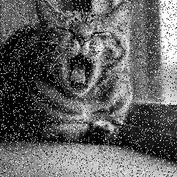
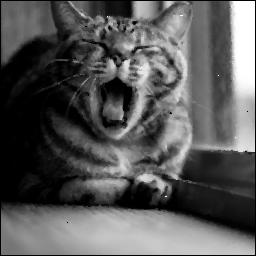

## Программа медианной фильтрации изображений
Данная программа предназначена для обработки изображений с целью удаления импульсного шума. Она добавляет шум к исходному изображению и затем применяет медианный фильтр для его очистки.

## Описание работы программы
1. **Загрузка исходного изображения**: Программа загружает изображение из папки `images`.
2. **Добавление импульсного шума**: Создаётся зашумленное изображение с 15% импульсного шума.
3. **Применение медианного фильтра**: Применяется крестообразный медианный фильтр размером 3x3 для удаления шума.
4. **Сохранение изображений**: Обработанные изображения сохраняются в папке `images`.

## Пример выполнения

### Исходное изображение

### Зашумленное изображение

### Отфильтрованное изображение

